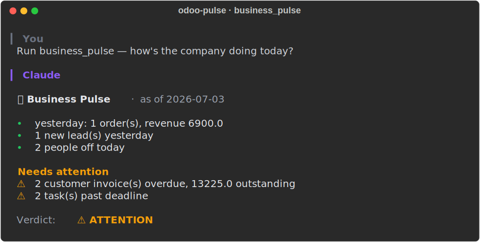

# odoo-pulse

[](https://github.com/minhhq-a1/odoo-pulse/actions/workflows/ci.yml)
[](https://pypi.org/project/odoo-pulse/)
[](LICENSE)

<!-- mcp-name: io.github.minhhq-a1/odoo-pulse -->

**An AI business analyst for your [Odoo](https://www.odoo.com) ERP.** Ask one
question, get one answer — numbers, highlights, risks, and a verdict
(on-track / at-risk / off-track) — over the [Model Context
Protocol](https://modelcontextprotocol.io). CRUD bridges to Odoo already exist;
this is the analytics layer that sits on top.



## The analyst tools

Each tool answers a whole management question in a single call, returning a
structured report with a verdict — not a raw dump you have to interpret.

| Tool | Answers |
| --- | --- |
| `business_pulse` ⭐ | The morning briefing: yesterday's sales, new leads, overdue invoices, late tasks, who's off — with a company-wide verdict |
| `pipeline_review` | CRM funnel by stage, stalled deals, weighted revenue, recent win rate |
| `sales_snapshot` | Revenue this period vs last (Δ%), top customers/products, stale quotations |
| `receivables_health` | AR/AP aging buckets, % overdue, top debtors |
| `inventory_risk` | Shortages (negative forecast) and dead stock |
| `absence_overview` | Who's off this week, pending approvals, thin-coverage departments |
| `procurement_watch` | Purchasing: late receipts, stale RFQs, open spend per vendor |
| `production_health` | Manufacturing: orders behind their planned start, stuck WIP |
| `sprint_health` · `team_workload` · `project_status_report` | Project delivery: completion, overloaded members, at-risk projects |

Every money-reporting tool takes an optional `company=` filter and flags
mixed-currency totals instead of silently summing them; verdict cut-offs
(stalled %, overdue %, growth %) are parameters, so you can calibrate them
to your business.

Under the hood it's the standard Odoo XML-RPC external API — nothing to install
inside Odoo, works on Odoo Online, Odoo.sh, and on-premise.

## Try it in 5 minutes

No Odoo account? Boot a demo Odoo pre-seeded with a story to tell (a stalled
deal, a 90-day-overdue invoice, a stock shortage, someone off today):

```bash
docker compose -f docker-compose.playground.yml up -d
```

Then point Claude at it and ask it to **`run business_pulse`**. Full
walkthrough: [docs/playground.md](docs/playground.md).

## Install & connect

Add it to Claude Code (no install step — `uvx` fetches it):

```bash
claude mcp add odoo-pulse \
  --env ODOO_URL=https://acme.odoo.com \
  --env ODOO_DB=acme \
  --env ODOO_USERNAME=you@example.com \
  --env ODOO_API_KEY=your-api-key \
  --env ODOO_READ_ONLY=true \
  -- uvx odoo-pulse
```

Generate the API key in Odoo under **Settings → Users → (your user) → Account
Security → New API Key**. Config for **Claude Desktop** and **Cursor**, plus pip
and Docker alternatives: [docs/install.md](docs/install.md).

## Read-only by default, safe writes when you want them

The server is read-only out of the box. Writes require four independent controls
to line up (`ODOO_READ_ONLY=false`, a model allow-list, a delete flag, and a
per-call `confirm=true` after a dry-run preview); system models are never
writable. Details: [docs/tools.md#write-operations](docs/tools.md#write-operations).

## More tools

Beyond the analyst reports, there are ~60 model-aware query tools spanning CRM,
Sales, Inventory, Accounting, HR, Project, Manufacturing, PoS, and Enterprise
apps — opt in via `ODOO_TOOL_GROUPS`. Full catalogue and configuration:
[docs/tools.md](docs/tools.md).

## Testing

The suite mocks the XML-RPC layer, so **no real Odoo or network is needed**:

```bash
pip install -e ".[dev]"
pytest
```

For a live check against a real Odoo (read-only), see
[docs/tools.md#live-smoke-test-against-a-real-odoo](docs/tools.md#live-smoke-test-against-a-real-odoo).

## License

[MIT](LICENSE)
